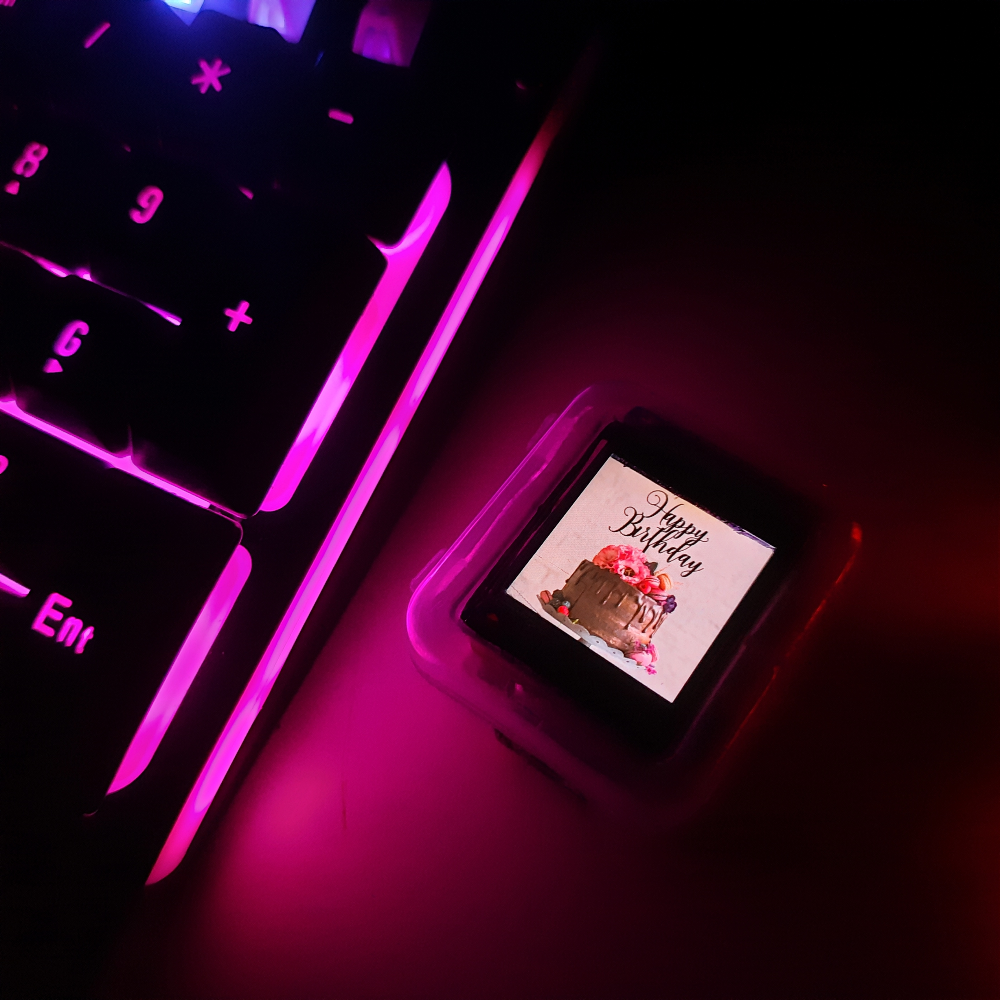
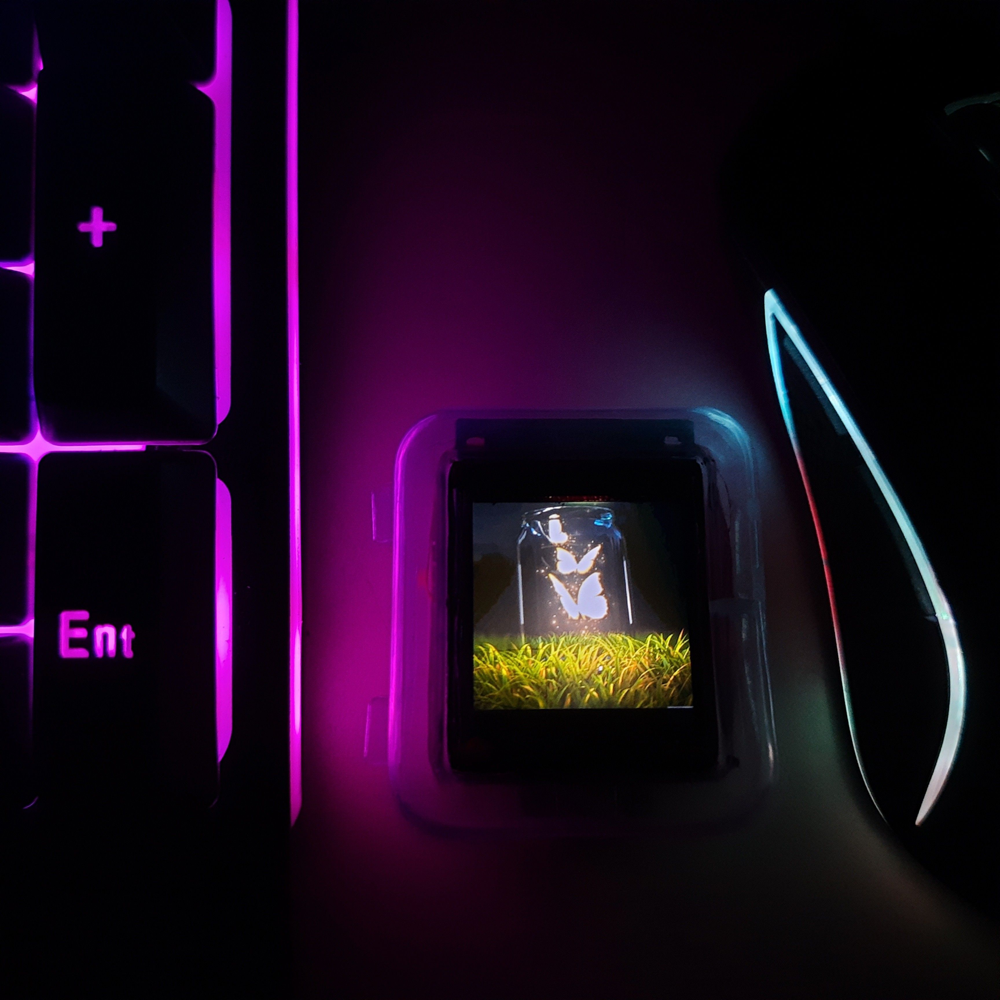
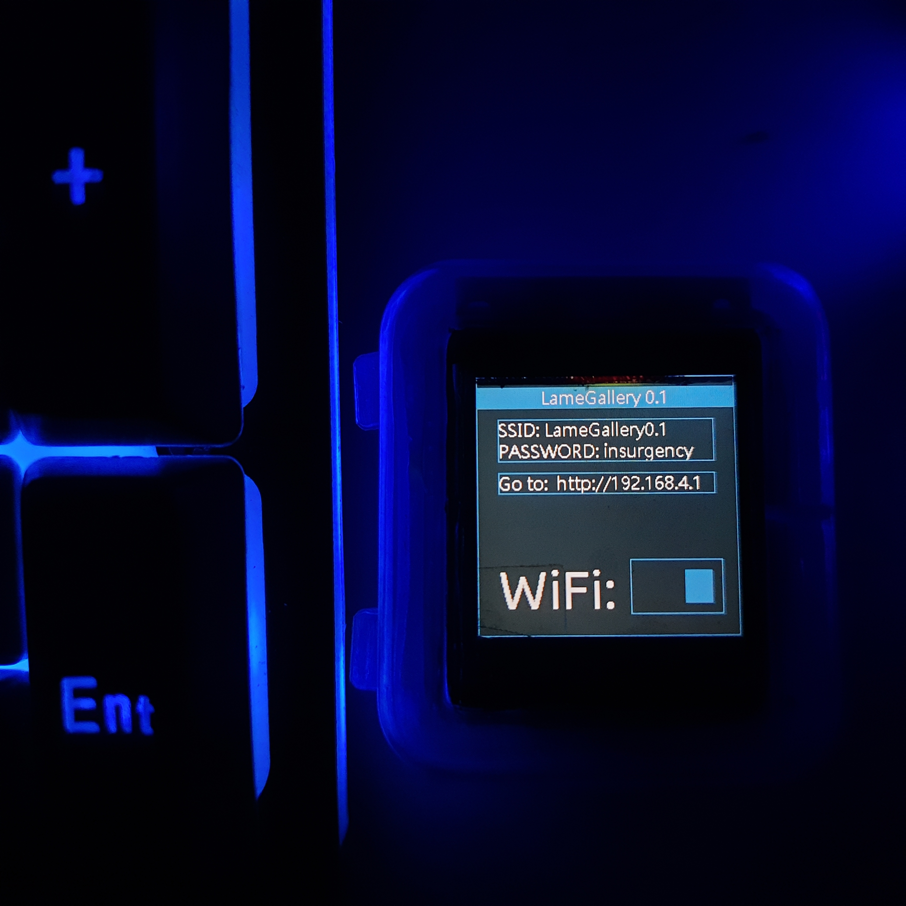
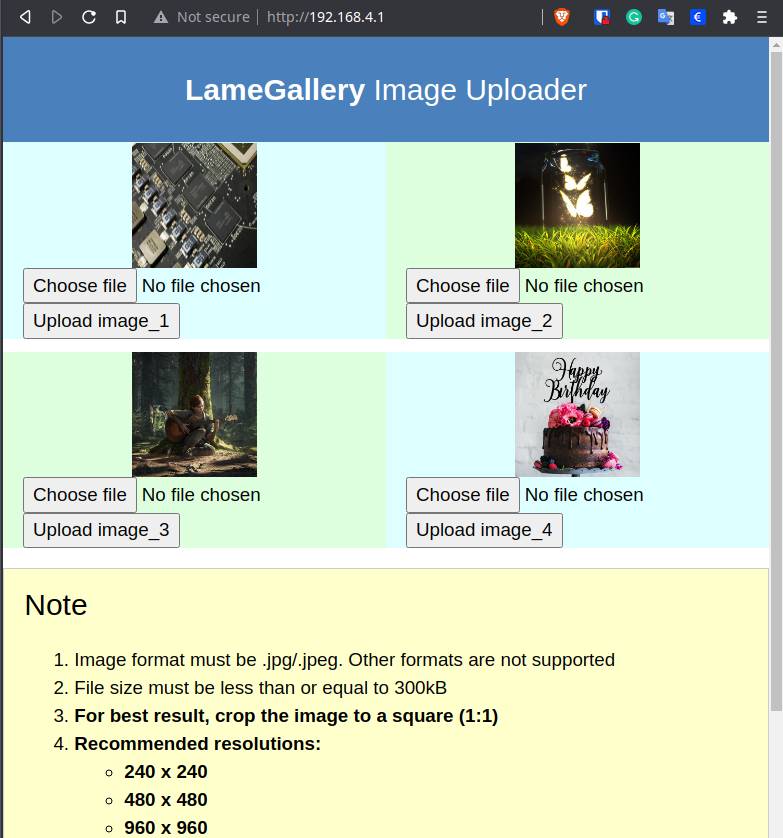

# LameGallery0.1

This is a tiny digital gallery powered by esp8266. User can upload up to (only) 4 images using wifi. This project is made as birthday gift for someone special.

For now I'm dumping everything here as it is, soon I'll write a better README and do some code clean-up.

This is just a prototype. Now I need make a proper PCB and a 3D printed enclosure.

## How TO Use:
1. Turn on LameGallery using the switch
2. Press the button (connected to GPIO0) to display the next image
3. Press and hold the button for 2-3 seconds to turn ON WiFi Access Point
4. Connect to the access point with the given SSID and Password
5. Go to the shown URL and upload up to 4 jpg files (each file <=300kB)
6. Press and hold the button for 2-3 seconds to turn OFF WiFi Access Point

## Parts:
1. ESP8266 (ESP-12E Board)
2. ST7789 240x240 IPS LCD Display

## Libraries:
1. Tjpg Decoder
2. TFT_eSPI (stripped unused parts)
3. LameUI

** Here I've used LameUI (https://github.com/abhra0897/LameUI) as the GUI library. This library is under development and is in the experimental phase.

## Demonstration

### View 1

### View 2

### View 3

### Normal Operation

### File Upload

 

